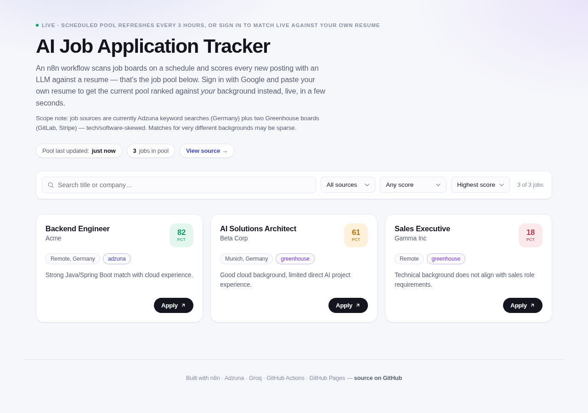
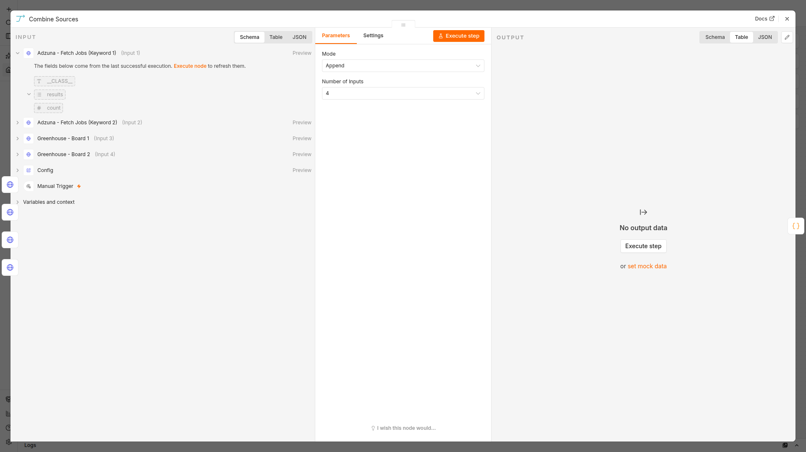
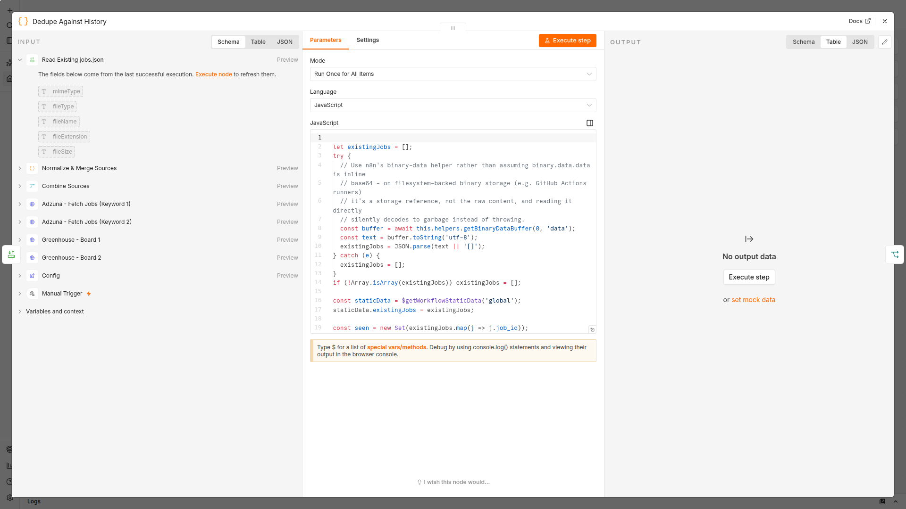
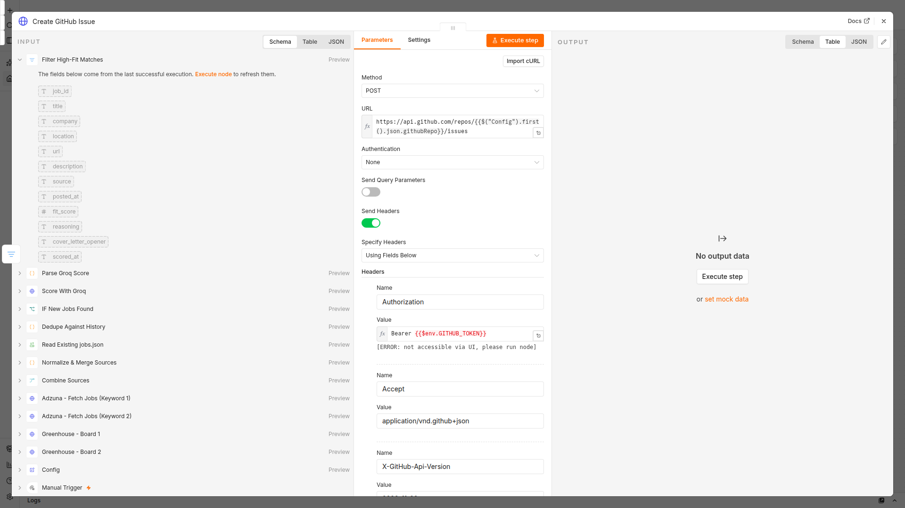
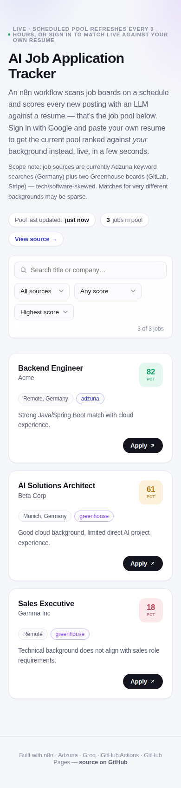

# 🎯 AI Job Application Tracker

A $0-forever, no-credit-card-anywhere job matching tool with two halves:

- **A scheduled collection pipeline**, built in [n8n](https://n8n.io) and run by GitHub Actions, that scans job boards every 3 hours and scores every new posting against a resume with an LLM — this is the public "job pool."
- **A live, per-user matching tool**: sign in with Google, paste your own resume, and get the current job pool ranked against *your* background in a few seconds, via a Cloudflare Worker calling Groq directly.

**Live demo:** https://mithulram.github.io/ai-job-tracker-n8n/

**Repo:** https://github.com/mithulram/ai-job-tracker-n8n



 <!-- TODO: replace with the recorded demo, see SETUP.md Phase 5 -->

---

## Why this project

Most "job tracker" side projects either need a database, a hosted server, or a Google Sheet with OAuth glue. This one deliberately avoids all of that:

- **No always-on server** for the collection pipeline — it runs as a scheduled **GitHub Action**, not a hosted n8n instance.
- **No database** — job data is a single JSON file (`data/jobs.json`) committed straight to the repo.
- **No Telegram/Slack/Sheets signup** — alerts are **GitHub Issues**, created with the `GITHUB_TOKEN` every Action already gets for free.
- **Live search stays serverless too** — a Cloudflare Worker (free tier) does the per-user matching, with Cloudflare KV (also free tier) for rate limiting. No database, no persistent compute there either.
- **No credit card, anywhere** — every service used (GitHub Actions, Adzuna, Groq, GitHub Pages, Google Identity Services, Cloudflare Workers/KV) is free with just an email/account signup, no billing details.

## Architecture

```
SUPPLY SIDE — scheduled collection (unchanged, still n8n + GitHub Actions)
──────────────────────────────────────────────────────────────────────────
GitHub Actions (cron, every 3h, public repo → unlimited free minutes)
   │
   ├─ checks out the repo, installs n8n, imports & executes workflows/workflow.json
   │
   │   Inside the n8n workflow:
   │   1. Fetch postings  — Adzuna API (2 keyword searches) + 2 Greenhouse company job boards
   │   2. Combine + normalize all sources into one job shape
   │   3. Dedupe          — drop anything already in data/jobs.json
   │   4. Score           — send each new job + a resume to Groq (LLM), get fit_score/reasoning/opener
   │   5. Save            — merge into data/jobs.json
   │   6. Alert           — fit_score ≥ 75 → open a GitHub Issue via the GITHUB_TOKEN
   │
   └─ commits & pushes the updated data/jobs.json back to the repo, then the runner shuts down

DEMAND SIDE — live, per-user matching (new)
──────────────────────────────────────────────────────────────────────────
Browser (docs/index.html, GitHub Pages)
   │
   ├─ "Sign in with Google" (Google Identity Services) → returns a signed ID token
   ├─ User pastes their resume, clicks "Find my matches"
   │
   ▼
Cloudflare Worker (worker/src/index.js, free tier)
   │
   ├─ Verifies the Google ID token's signature against Google's public keys (real
   │  cryptographic verification, not a client-trust shortcut)
   ├─ Checks Cloudflare KV: has this user searched recently? Has today's shared
   │  search budget been used up? → if so, returns a clear rate-limit message
   ├─ Fetches the current data/jobs.json straight from this repo (raw GitHub content)
   ├─ Scores the newest few postings against the pasted resume via Groq — live
   ├─ Records the new cooldown + increments the shared daily counter in KV
   │
   ▼
Results render in the same job-card UI, in a few seconds

GitHub Pages (static, always-on, free, serves from /docs)
   └─ docs/index.html shows the static pool by default (signed-out visitors),
      and switches to live per-resume results after a signed-in search.
```

### Why n8n runs the collection pipeline but not live search

This is a deliberate trade-off, not an oversight. A GitHub Actions runner takes roughly 30-90 seconds to cold-start — fine for a background job that fires every 3 hours, completely wrong for a button someone just clicked and is waiting on. Routing live search through n8n/Actions "for consistency" would have made the one interactive part of this app feel broken.

So the split is: **n8n owns the collection pipeline** (where its workflow-orchestration strengths — multi-source fetching, branching, retry-friendly node graphs, visual debuggability — genuinely pay off, and where latency doesn't matter). **A lightweight Cloudflare Worker owns live search** (where a single fast round-trip to one LLM call is all that's needed, and a Worker responds in low hundreds of milliseconds plus LLM time, not tens of seconds). Using the right tool for each half of the problem, instead of forcing one engine to do both, is the actual engineering decision here.

## Tech stack

| Layer | Tool |
|---|---|
| Collection workflow engine | [n8n](https://n8n.io) (open source, run headlessly via `n8n execute`) |
| Collection scheduling + compute | GitHub Actions (public repo, cron + manual trigger) |
| Job sources | [Adzuna API](https://developer.adzuna.com/) + Greenhouse public job board JSON |
| LLM scoring (both pipeline and live search) | [Groq](https://groq.com) (`openai/gpt-oss-120b`) |
| Data store | `data/jobs.json`, committed to the repo |
| Scheduled alerts | GitHub Issues (via the built-in `GITHUB_TOKEN`) |
| Sign-in | Google Identity Services (client-side, ID-token based) |
| Live matching backend | Cloudflare Worker (`worker/src/index.js`) |
| Rate limiting | Cloudflare KV (per-user cooldown + shared daily cap) |
| Dashboard | Static HTML/CSS/JS on GitHub Pages (served from `/docs`) |

## Cost & card check

| Component | Card required? | Cost | Notes |
|---|---|---|---|
| GitHub Actions (public repo) | No | Free, unlimited minutes | Private repos get a monthly minute cap — this only works free-forever on a **public** repo |
| n8n (self-run CLI) | No | Free | Open source, no n8n Cloud account used |
| Adzuna API | No (email only) | Free tier | Free tier has a call-volume cap; a 3-hourly schedule stays well within it |
| Greenhouse job boards | No | Free | Public, unauthenticated JSON endpoints |
| Groq API | No (email only) | Free tier | RPM/RPD/TPM/TPD caps (see below); both the pipeline and the Worker are sized to stay under them |
| GitHub Issues | No | Free | Built into every repo |
| GitHub Pages | No | Free | Public repos only |
| Google Identity Services | No | Free | Creating an OAuth Client ID in Google Cloud Console does not require billing to be enabled |
| Cloudflare Workers | No | Free — 100,000 requests/day, 10ms CPU/invocation | Verified against Cloudflare's published pricing docs at build time; free signup, no card |
| Cloudflare KV | No | Free — 100k reads/day, 1,000 writes/day, 1GB storage | Live search does 2 writes/search, so the write cap (not Groq) is actually the tightest ceiling — see rate-limit design below |

No component here has a hidden metered cost — every free tier used is a hard rate/volume cap, not a "free trial that later bills you." Free-tier terms can change on any of these providers; re-check before relying on this in production.

### Live search rate-limit design

Sized against Groq's published free-tier limits for `openai/gpt-oss-120b` (RPM 30, RPD 1000, TPM 8000, TPD 200000) and Cloudflare KV's free write cap (1,000/day):

- **6 jobs scored per search** — keeps one search comfortably under Groq's 8000 TPM.
- **4-hour cooldown per signed-in user** — identified by the Google ID token's `sub` claim, nothing else is stored.
- **40 shared searches/day, hard cap** — once hit, everyone sees a clear "try again tomorrow" message instead of the app silently failing or quietly exceeding Groq's quota. 40 searches × 6 jobs = 240 Groq requests/day and ~180k tokens/day, both comfortably under Groq's daily caps, and 40 × 2 KV writes/search = 80 writes/day, well under KV's 1,000/day cap.

## Scope note (honest, not hidden)

The job pool currently comes from Adzuna keyword searches (Germany) plus two Greenhouse boards (GitLab, Stripe) — tech/software-skewed. Someone with a very different professional background will get sparse or low matches, and the dashboard copy says so rather than implying this works well for "any" resume. Broadening job sources is a natural next step, not something this version pretends to have solved.

## Repo structure

```
/workflows/workflow.json     n8n workflow (source of truth for the collection pipeline)
/.github/workflows/run.yml   GitHub Actions cron job that runs the workflow headlessly
/data/jobs.json              committed job pool (JSON array), updated every scheduled run
/docs/index.html             dashboard + live search UI, published via GitHub Pages
/docs/screenshots/           screenshots for this README
/docs/demo.gif               short demo recording (see SETUP.md)
/worker/                     Cloudflare Worker: live per-user matching backend
/scripts/build_workflow.js   generates workflows/workflow.json programmatically
/SETUP.md                    setup + local dev + demo recording instructions
```

## The n8n workflow, node by node

The canvas (sticky notes included):


This is the part of the project that actually had real bugs and real fixes along the way — worth walking through honestly rather than glossing over.

**Manual Trigger → Config.** The trigger exists only so the workflow is directly executable/testable; the real schedule lives in `.github/workflows/run.yml`, not inside n8n. `Config` is a single Set node holding every tunable value in one place — search keywords, location, the resume text block, the fit-score alert threshold, how many jobs to score per run, and the two Greenhouse company slugs. Anyone adapting this fetches nothing else to configure.

**Adzuna ×2 / Greenhouse ×2 (parallel HTTP fetches).** Two Adzuna searches (different keyword phrases — Adzuna's `what` param does phrase matching, not OR-matching across multiple terms, so two separate calls beat one overly-broad or overly-narrow one) plus two Greenhouse company boards, all firing in parallel off Config.

**Combine Sources (Merge node, mode: Append, 4 inputs).** This node exists because of a real bug: originally the four fetch nodes connected directly into the next Code node's single input. In n8n, multiple nodes feeding one input fires that downstream node once *per incoming branch*, not once with everything combined — and since that Code node manually pulled data from all four named sources on every firing, it silently reconstructed and re-emitted the full job list up to 4× per run. `Combine Sources` collects all four branches and fires exactly once, which is what the code downstream actually assumes.

**Normalize & Merge Sources (Code node).** Turns Adzuna's `results[]` and each Greenhouse board's `jobs[]` into one common shape (`job_id`, `title`, `company`, `location`, `url`, `description`, `source`, `posted_at`), hashing a stable `job_id` from the source + original id. Also applies a lightweight keyword relevance filter (title/description) — Greenhouse boards return every open role at a company, most of which (sales, exec, etc.) are never going to be a fit, and scoring them anyway would burn Groq quota for nothing.

**Read Existing jobs.json → Dedupe Against History (Code node).** Reads the already-checked-out `data/jobs.json` and drops any normalized job whose `job_id` is already in it — this is the other node with a real bug behind it. The binary-read initially assumed `binary.data.data` was inline base64; on GitHub Actions runners, n8n's binary data is filesystem-backed by default, so that field is a storage reference, not the content, and decoding it as base64 silently produced garbage that failed to parse — caught by a `try/catch`, so `existingJobs` quietly resolved to `[]` and *everything* looked new, every run. Fixed by using n8n's own `this.helpers.getBinaryDataBuffer()` helper instead of hand-rolling the decode. Also caps how many new jobs get scored per run (`maxJobsToScorePerRun`), so a sudden batch of new postings can't blow through Groq's free-tier rate limits in one execution.

**IF New Jobs Found.** A cheap early-out: if dedupe found nothing new, skip straight to re-saving the existing pool unchanged rather than doing pointless work.

**Score With Groq (HTTP Request).** One POST per new job to Groq's chat completions endpoint (`openai/gpt-oss-120b`), with the resume text and job details in the prompt, `response_format: json_object` to force clean JSON back. Uses n8n's built-in request batching (`batchSize: 1`, `batchInterval: 7000`) to throttle calls 7 seconds apart — Groq's free tier has a per-minute token budget, and without throttling a burst of new postings would trip it mid-run.

**Parse Groq Score (Code node).** Parses the model's JSON response defensively (wrapped in try/catch, since an LLM occasionally doesn't return perfectly clean JSON even when asked), clamps `fit_score` to 0–100, and attaches `reasoning` / `cover_letter_opener` / `scored_at` onto the job record.

**Merge With History → Write jobs.json.** Combines newly-scored jobs with everything already in the pool (read earlier, stashed in workflow static data) and writes the full array back to `data/jobs.json`, which the Action then commits.

**Filter High-Fit Matches → Create GitHub Issue.** In parallel with the save, any newly-scored job at or above the configured threshold (default 75) gets a GitHub Issue opened via the Action's own `GITHUB_TOKEN` — the third real bug: the request originally included `labels: ["job-match", "auto-generated"]`, and GitHub's issue-creation endpoint returned a `422 Validation Failed` on the label (the Action's token can't auto-create new labels), which killed the entire run on exactly the branch that matters most. Fixed by dropping the labels field — title and body are what carry the signal anyway.

Close-ups of the two most bug-prone nodes and the alerting node, for anyone who wants to see the actual code rather than take the summary's word for it:





## Screenshots



## Setup

See [SETUP.md](SETUP.md) for local development, Google/Cloudflare setup for live search, running the workflow yourself, and recording a demo.

## License

MIT
