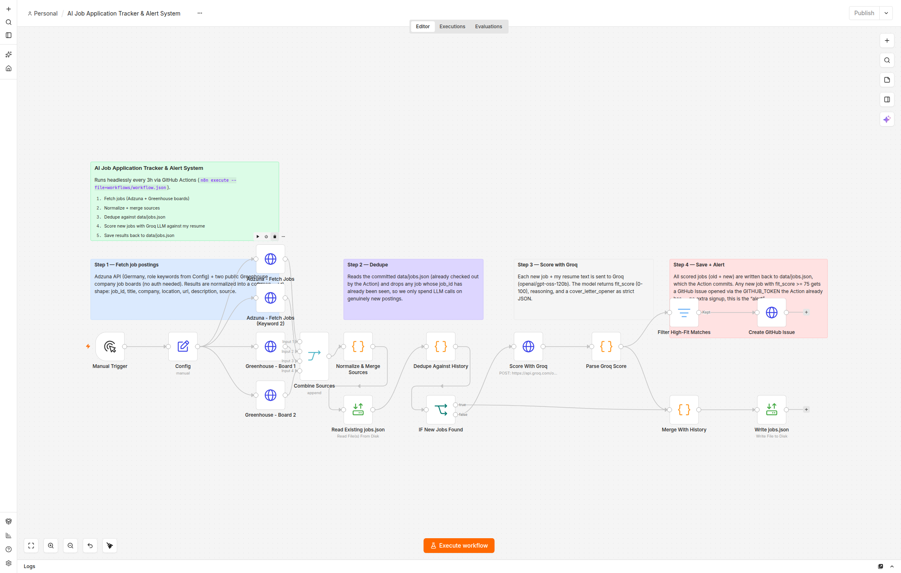

# 🎯 AI Job Application Tracker & Alert System

A fully automated, **$0-forever, no-credit-card-required** job search pipeline built on [n8n](https://n8n.io). It scans job boards, scores every new posting against my resume with an LLM, opens a GitHub Issue for strong matches, and publishes all results to a public live dashboard — all running on GitHub's free infrastructure, with nothing hosted 24/7.

**Live demo dashboard:** https://mithulram.github.io/ai-job-tracker-n8n/ <!-- TODO: confirm URL once GitHub Pages is enabled -->

**Repo:** https://github.com/mithulram/ai-job-tracker-n8n

 <!-- TODO: replace with the recorded demo, see SETUP.md Phase 5 -->

---

## Why this project

Most "job tracker" side projects either need a database, a hosted server, or a Google Sheet with OAuth glue. This one deliberately avoids all of that:

- **No server** — the automation runs as a scheduled **GitHub Action**, not a hosted n8n instance. Nothing runs 24/7.
- **No database** — job data is a single JSON file (`data/jobs.json`) committed straight to the repo.
- **No Telegram/Slack/Sheets signup** — alerts are **GitHub Issues**, created with the `GITHUB_TOKEN` every Action already gets for free.
- **No credit card, anywhere** — every service used (GitHub Actions on a public repo, Adzuna, Groq, GitHub Pages) is free with just an email signup, no billing details.

## Architecture

```
GitHub Actions (cron, every 3h, public repo → unlimited free minutes)
   │
   ├─ checks out the repo, installs n8n, imports & executes workflows/workflow.json
   │
   │   Inside the n8n workflow:
   │   1. Fetch postings  — Adzuna API (2 keyword searches) + 2 Greenhouse company job boards
   │   2. Normalize + merge all sources into one job shape
   │   3. Dedupe          — drop anything already in data/jobs.json
   │   4. Score           — send each new job + my resume to Groq (LLM), get fit_score/reasoning/opener
   │   5. Save            — merge into data/jobs.json
   │   6. Alert           — fit_score ≥ 75 → open a GitHub Issue via the GITHUB_TOKEN
   │
   └─ commits & pushes the updated data/jobs.json back to the repo, then the runner shuts down

GitHub Pages (static, always-on, free)
   └─ dashboard/index.html fetches data/jobs.json straight from the repo and renders
      searchable, sortable, color-coded job cards — this is the live demo link.
```

## Tech stack

| Layer | Tool |
|---|---|
| Automation engine | [n8n](https://n8n.io) (open source, run headlessly via `n8n execute`) |
| Scheduling + compute | GitHub Actions (public repo, cron + manual trigger) |
| Job sources | [Adzuna API](https://developer.adzuna.com/) + Greenhouse public job board JSON |
| LLM scoring | [Groq](https://groq.com) (`openai/gpt-oss-120b`) |
| Data store | `data/jobs.json`, committed to the repo |
| Alerts | GitHub Issues (via the built-in `GITHUB_TOKEN`) |
| Dashboard | Static HTML/CSS/JS on GitHub Pages |

## Cost & card check

| Component | Card required? | Cost | Notes |
|---|---|---|---|
| GitHub Actions (public repo) | No | Free, unlimited minutes | Private repos get a monthly minute cap — this only works free-forever on a **public** repo |
| n8n (self-run CLI) | No | Free | Open source, no n8n Cloud account used |
| Adzuna API | No (email only) | Free tier | Free tier has a call-volume cap; a 3-hourly schedule stays well within it |
| Greenhouse job boards | No | Free | Public, unauthenticated JSON endpoints |
| Groq API | No (email only) | Free tier | Free tier enforces per-minute token/request limits — the workflow batches and caps LLM calls per run to respect this |
| GitHub Issues | No | Free | Built into every repo |
| GitHub Pages | No | Free | Public repos only |

No component here has a hidden metered cost — every free tier used is a hard rate/volume cap, not a "free trial that later bills you."

## Repo structure

```
/workflows/workflow.json     n8n workflow (source of truth for the automation)
/.github/workflows/run.yml   GitHub Actions cron job that runs the workflow headlessly
/data/jobs.json              committed job data (JSON array), updated every run
/dashboard/                  static dashboard published via GitHub Pages
/docs/screenshots/           screenshots for this README
/docs/demo.gif               short demo recording (see SETUP.md)
/scripts/build_workflow.js   generates workflows/workflow.json programmatically
/SETUP.md                    setup + local dev + demo recording instructions
```

## How the workflow scores jobs

Each new (not-yet-seen) job posting is sent to Groq along with a resume text block, and the model returns:

- `fit_score` — 0-100
- `reasoning` — 2-3 sentences explaining the score
- `cover_letter_opener` — a tailored opening line for a cover letter

Everything about the search — keywords, location, resume text, score threshold — lives in **one place**: the `Config` node at the top of `workflows/workflow.json`. Open it in the n8n editor (or edit the JSON directly) to point it at your own resume and target roles.

## Screenshots

<!-- TODO: add screenshots to docs/screenshots/ and reference them here, e.g.: -->
<!--  -->
<!--  -->
<!--  -->

## Setup

See [SETUP.md](SETUP.md) for local development, running the workflow yourself, and recording a demo.

## License

MIT
